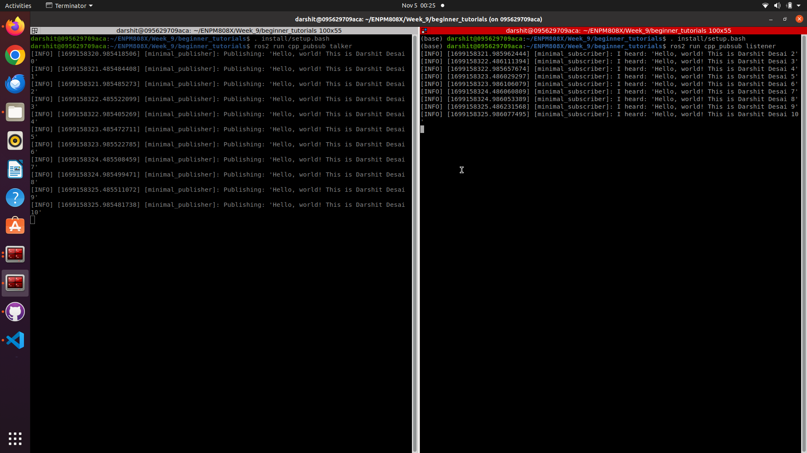

# Beginner_Tutorials ROS2 ENPM808X

Using ROS2 Humble and Object Oriented approach for C++ simple publisher and subscriber program is created in this repository.

## Building and Running Instructions

```bash
# Source to ROS2 HUMBLE
source /opt/ros/humble/setup.bash
# Make your ros2 workspace
mkdir ros2_ws
# Go to the source directory of your ros2 workspace
cd ~/ros2_ws
git clone https://github.com/darshit-desai/beginner_tutorials.git

# Install rosdep dependencies before building the package
rosdep install -i --from-path src --rosdistro humble -y
# Build the package using colcon build
colcon build --packages-select beginner_tutorials
# After successfull build source the package
. install/setup.bash
# Run the publisher in terminal#1
ros2 run beginner_tutorials talker
# Run the subscriber in terminal#2 (Split the terminal and source ROS2 and the workspace setup.bash)
ros2 run beginner_tutorials listener 
```

### CppCheck & CppLint
```bash
# Use the below command for cpp check by moving to directory beginner_tutorials
cppcheck --enable=all --std=c++17 --suppress=missingInclude $( find . -name *.cpp | grep -vE -e "^./build/" ) --check-config > results/cppcheck.txt

# Use the below command for cpp lint by moving to directory beginner_tutorials 
cpplint --filter=-build/c++11,+build/c++17,-build/namespaces,-build/include_order  src/cpp_pubsub/src/*.cpp >  results/cpplint.txt

## The results of both are present in results folder insider beginner_tutorials directory
```

## Results Screenshot

Below is the screenshot of the Listener (Subscriber) and Talker (Publisher) running:




