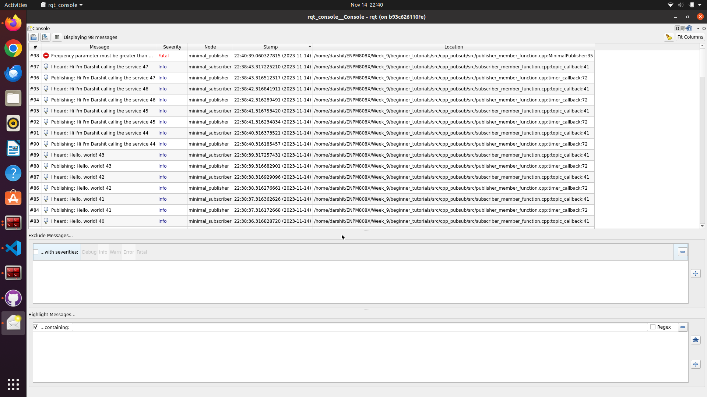
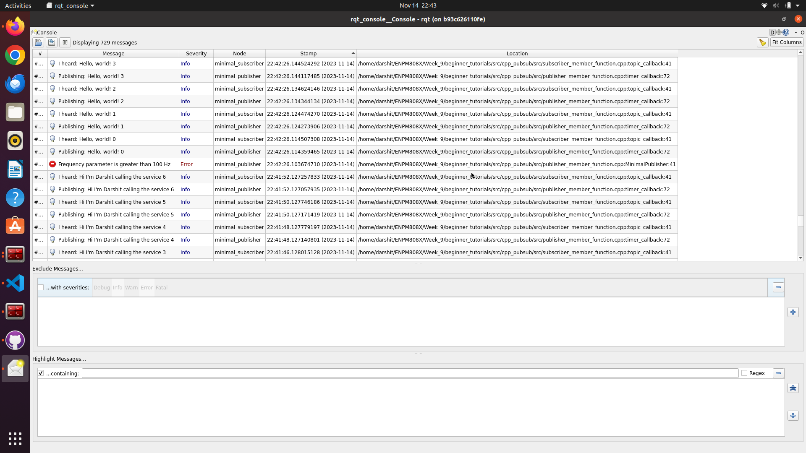
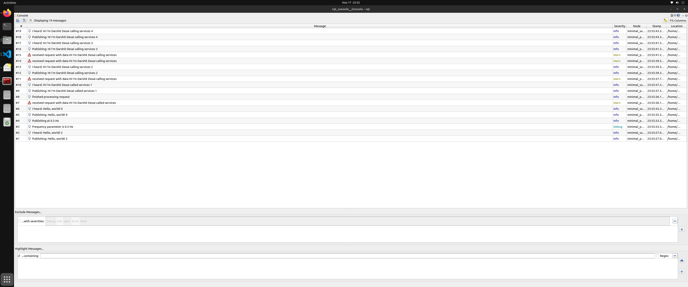
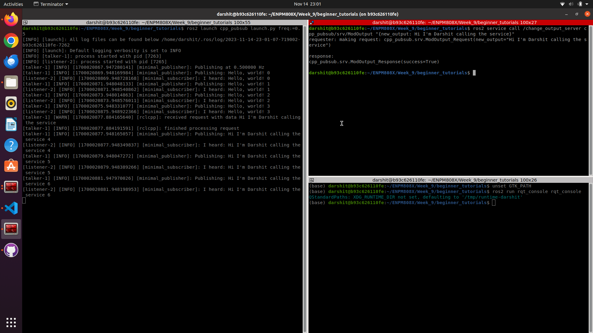

# Beginner_Tutorials ROS2 ENPM808X

Tutorial Part_Release1.0
Using ROS2 Humble and Object Oriented approach for C++ simple publisher and subscriber program is created in this repository.

Tutorial Part_Release2.0
Modify the publisher subscriber nodes to accomodate a service call such that it changes the published message

Tutorial Part_Release3.0
Modify the publisher subscriber nodes to accomodate tf publishing and add a launch file for rosbagging the data

## Building and Running Instructions

```bash
# Source to ROS2 HUMBLE
source /opt/ros/humble/setup.bash
# Make your ros2 workspace
mkdir ros2_ws
# Go to the source directory of your ros2 workspace
cd ~/ros2_ws
git clone https://github.com/darshit-desai/beginner_tutorials.git

# Install rosdep dependencies before building the package
rosdep install -i --from-path src --rosdistro humble -y
# Build the package using colcon build
colcon build --packages-select cpp_pubsub
# After successfull build source the package
. install/setup.bash
# Run the publisher in terminal#1
ros2 run beginner_tutorials talker
# Run the subscriber in terminal#2 (Split the terminal and source ROS2 and the workspace setup.bash)
ros2 run beginner_tutorials listener
# Service call run without launch file in Terminal 3 (Split the terminal and source ROS2 and the workspace setup.bash)
ros2 service call /change_output_server cpp_pubsub/srv/ModOutput "{new_output: Hi I'm Darshit calling the service}"

# Run with the launch file in Terminal 1
ros2 launch cpp_pubsub launch.py freq:=0.5 #Freq needs to be double datatype 
# Service call run with launch file in Terminal 2 (Split the terminal and source ROS2 and the workspace setup.bash)
ros2 service call /change_output_server cpp_pubsub/srv/ModOutput "{new_output: Hi I'm Darshit calling the service}"

#####FOR ASSIGNMENT#3 RUN THE FOLLOWING AFTER BUILDING THE NODE######
# Run command for checking the tf Publishing topic
# Run the publisher in terminal#1
ros2 run beginner_tutorials talker
# Run the following command in terminal#2
ros2 run tf2_tools view_frames # Generates pdf of tf tree
ros2 run tf2_ros tf2_echo world talk # Pings the publisher to get tf frame messages
# For rosbagging kill the talker node in Terminal#1
ros2 launch cpp_pubsub rosbag_launch.py freq:=1.0 record_rosbag:=True #Note if record_rosbag is False then no rosbag will be recording
# Once done recording to view the bag info or play the rosbag
ros2 bag play rosbag2_2023_11_20-14_59_06 #For playing the rosbag
ros2 bag info rosbag2_2023_11_20-14_53_00/ #For info of the bag file
# For running the ros test
colcon build --packages-select cpp_pubsub # Build the package
source install/setup.bash # Source the package
colcon test --packages-select cpp_pubsub # Command to run the test
cat log/latest_test/cpp_pubsub/stdout_stderr.log # Command to view the test result
```

### CppCheck & CppLint
```bash
# Use the below command for cpp check by moving to root directory of your workspace
cppcheck --enable=all --std=c++17 --suppress=missingIncludeSystem $( find . -name *.cpp | grep -vE -e "^(./build/|./install/|./log/)" ) --check-config  &> results/cppcheck.txt

# Use the below command for cpp lint by moving to root directory of your workspace 
cpplint  --filter=-build/c++11,+build/c++17,-build/namespaces,-build/include_order $( find . -name *.cpp | grep -vE -e "^(./build/|./install/|./log/)" ) &> results/cpplint.txt 

## The results of both are present in results folder insider beginner_tutorials directory
```

## Results Screenshot

Below is the screenshot of the rqt console logging levels:

* Fatal error test

* Normal error test

* Warning and debug test

* Service call terminal screenshot



    

